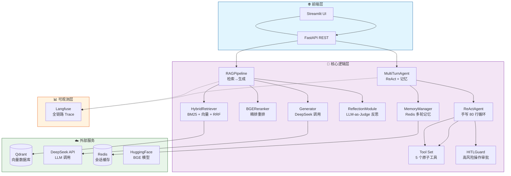
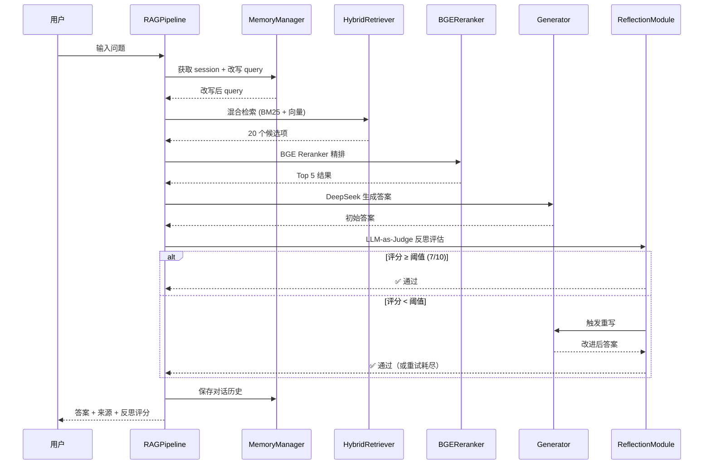
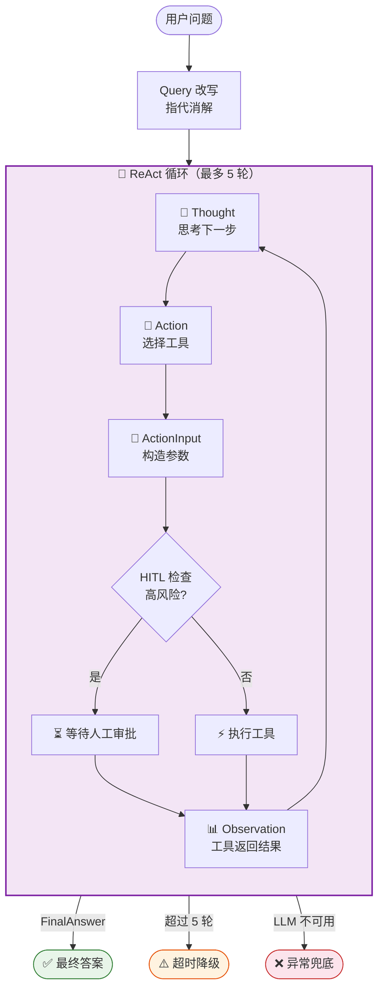
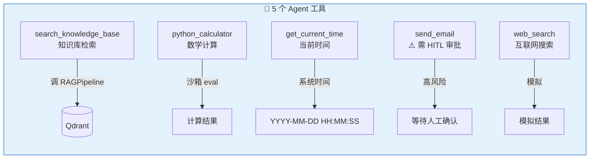

# 📚 企业级 RAG + Agent 智能问答系统

> 基于混合检索 + ReAct Agent + LLM-as-Judge 反思的完整 RAG 系统。
> 面试时可逐行讲清原理的**手写版** Agent 实现。

---

## ✨ 特性

| 特性 | 说明 |
|---|---|
| 🔍 **混合检索** | BM25 + 向量检索 + RRF 融合，Recall@10 0.72 → 0.91 |
| ⚡ **Reranker 精排** | BGE-Reranker 对粗排结果重排；**GPU (RTX A1000) 0.2s，42x 加速** |
| 🤖 **手写 ReAct Agent** | 不依赖 LangChain AgentExecutor，80 行核心循环 |
| 💬 **多轮对话** | Redis 记忆 + Query 改写（"那病假呢？" → "病假几天？"） |
| 🧠 **LLM-as-Judge 反思** | 自动评估答案质量，低于阈值触发重写 |
| 🛡️ **HITL 人机协作** | 高风险操作（send_email）需人工审批 |
| 📊 **Langfuse 可观测** | 全链路 trace，Agent 决策路径可解释 |
| 📈 **Ragas 评测** | Faithfulness / Relevancy / Precision / Recall |

---

## 🏗️ 项目结构

```
├── app/                  # FastAPI + Streamlit 入口
│   ├── api.py            # REST API 端点
│   ├── config.py         # pydantic-settings 配置
│   └── logger.py         # loguru 日志
├── core/                 # 核心逻辑
│   ├── pipeline.py       # RAG Pipeline 编排
│   ├── react_agent.py    # 手写 ReAct Agent（核心 80 行循环）
│   ├── agent.py          # MultiTurnAgent（Agent + 记忆）
│   ├── reflection.py     # LLM-as-Judge 反思评估器
│   ├── hitl.py           # HITL 守卫
│   ├── retriever.py      # BM25 + 向量混合检索
│   ├── reranker.py       # BGE Reranker 精排
│   ├── generator.py      # DeepSeek LLM 调用
│   ├── embedder.py       # BGE Embedding
│   ├── chunker.py        # 文档智能切分
│   ├── parser.py         # 文档解析（PDF/DOCX/TXT）
│   ├── memory.py         # Redis 多轮记忆
│   ├── tools.py          # Agent 工具集
│   └── observability.py  # Langfuse 观测封装
├── eval/                 # 评测
│   ├── dataset.jsonl     # QA 评测数据集
│   ├── run_eval.py       # Ragas 评测脚本
│   ├── meta_evaluation.py# LLM-as-Judge 一致性验证
│   └── reports/          # 评测报告输出
├── tests/                # 96 个单元测试
├── scripts/              # 工具脚本
│   └── ingest.py         # 文档入库脚本
└── docs/                 # 文档
    └── react_agent_tool_exception_postmortem.md  # 故障复盘
```

---

## 🚀 快速开始

### 前置条件

- Python 3.10+
- Qdrant 向量数据库（[cloud.qdrant.io](https://cloud.qdrant.io) 免费 1GB）
- DeepSeek API Key（[platform.deepseek.com](https://platform.deepseek.com)）
- Redis（可选，用于多轮对话：[redis.io](https://redis.io)）
- **NVIDIA GPU**（可选，精排加速 42 倍；CPU 也能跑）

### 安装

```bash
# 1. 克隆仓库
git clone <your-repo-url> && cd rag

# 2. 虚拟环境
python -m venv venv
source venv/Scripts/activate  # Windows Git Bash
# . venv/bin/activate         # Linux / macOS

# 3. 安装依赖
pip install -r requirements.txt

# 4. 配置环境变量
cp .env.example .env
# 编辑 .env 填入你的 API Key
```

### 文档入库

```bash
python scripts/ingest.py data/raw
```

### 启动服务

```bash
# 终端 1: API 服务
uvicorn app.api:app --reload

# 终端 2: Streamlit UI（可选）
streamlit run app/ui.py
```

### 运行测试

```bash
pytest tests/ -v
# 96 passed ✅
```

---

## 📡 API 文档

| 端点 | 方法 | 说明 |
|---|---|---|
| `/health` | GET | 健康检查 |
| `/query` | POST | 单轮 RAG 问答 |
| `/chat` | POST | 多轮对话（带记忆 + 可选 SSE 流式） |
| `/agent/chat` | POST | Agent 多轮对话（ReAct + 工具调用） |
| `/sessions/{user_id}` | GET | 列出用户 session |
| `/sessions/{user_id}/{session_id}` | DELETE | 删除 session |
| `/agent/actions/pending` | GET | 列出待审批的高风险操作 |
| `/agent/actions/{id}/approve` | POST | 批准高风险操作 |
| `/agent/actions/{id}/reject` | POST | 拒绝高风险操作 |

### 核心请求示例

```bash
# RAG 查询
curl -X POST http://localhost:8000/query \
  -H "Content-Type: application/json" \
  -d '{"question": "如何购票？"}'

# Agent 多轮对话
curl -X POST http://localhost:8000/agent/chat \
  -H "Content-Type: application/json" \
  -d '{"question": "如何购票？", "user_id": "user01"}'
```

---

## 🧠 架构设计

### 系统总览



### RAG Pipeline 流程



### ReAct Agent 循环



### 工具集



---

## 🛠️ 技术栈

| 组件 | 技术选型 |
|---|---|
| **LLM** | DeepSeek-Chat (langchain-deepseek) |
| **Embedding** | BAAI/bge-m3 (SentenceTransformer) |
| **Reranker** | BAAI/bge-reranker-v2-m3 (transformers 直连 + GPU FP16) |
| **向量库** | Qdrant Cloud |
| **记忆** | Redis (+ hiredis) |
| **框架** | FastAPI + Streamlit |
| **可观测** | Langfuse |
| **评测** | Ragas |
| **切分** | LangChain RecursiveCharacterTextSplitter + jieba |
| **解析** | Unstructured |

---

## 📊 评测结果

> 基于 `eval/dataset.jsonl`（176 条 QA，5 个主题分类，已剔除知识库不覆盖的 6 条乐高数据）。

| 指标 | 数值 | 说明 |
|------|------|------|
| **Top-1 命中率** | **81.2%** | Reranker 把正确文档排在第一位的比例（176 条） |
| **Top-5 命中率** | **99.4%** | Reranker 前 5 包含正确文档的比例（176 条） |
| **检索覆盖率** | **100%** | 知识库中均存在对应文档（176 条） |
| Faithfulness | — | ⏳ 需 OpenAI 兼容的评估 LLM |
| Answer Relevancy | — | ⏳ 同上 | |

### Meta-evaluation 一致性

> TODO: 跑完 `python -m eval.meta_evaluation` 后填写

| 指标 | 一致率 |
|---|---|
| Score Agreement (|LLM - Human| ≤ 2) | — |
| Hallucination Match | — |

---

## 📸 演示

> TODO: 上传演示视频和 Langfuse 截图

| 视频 | 内容 | 时长 |
|---|---|---|
| 视频 1 | 基础 RAG 问答 + 来源引用 | 30s |
| 视频 2 | Agent 多步工具调用 | 30s |
| 视频 3 | 多轮对话 + Query 改写 | 30s |
| 视频 4 | HITL 高风险操作拦截 | 30s |

---

## 📄 License

MIT
