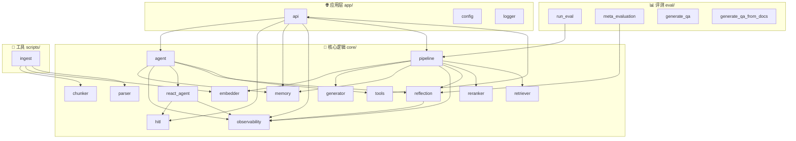

# 🧩 代码架构 — 模块依赖与类关系

> 自动生成于 2026-07-18

---

## 模块依赖图



---

## 核心模块职责速查

| 模块 | 层级 | 职责 |
|---|---|---|
| `app/api.py` | 入口 | FastAPI 路由，接收所有 HTTP 请求 |
| `app/config.py` | 配置 | pydantic-settings 环境变量加载 |
| `app/logger.py` | 工具 | loguru 日志配置 |
| | | |
| `core/pipeline.py` | 编排 | RAG 全流程编排：检索 → 精排 → 生成 → 反思 |
| `core/retriever.py` | 检索 | BM25 + 向量混合检索 + RRF 融合 |
| `core/reranker.py` | 精排 | BGE-Reranker 重排 |
| `core/generator.py` | 生成 | DeepSeek LLM 调用（含流式） |
| `core/embedder.py` | 嵌入 | BGE-M3 Embedding |
| `core/reflection.py` | 反思 | LLM-as-Judge 质量评估 |
| `core/agent.py` | Agent | MultiTurnAgent 封装 |
| `core/react_agent.py` | Agent | 手写 ReAct 循环（核心 80 行） |
| `core/tools.py` | Agent | 5 个工具定义 |
| `core/hitl.py` | Agent | 高风险操作审批守卫 |
| `core/memory.py` | 记忆 | Redis 多轮对话 + Query 改写 |
| `core/observability.py` | 可观测 | Langfuse 封装 |
| `core/parser.py` | 解析 | PDF/DOCX/TXT/PPTX 文档解析 |
| `core/chunker.py` | 切分 | 智能文本切分 |

---

## 调用链路

### RAG 链路
```
/chat → pipeline.query_with_memory()
      → memory.rewrite_query_with_context()
      → hybrid_retriever.search()        ← BM25 + Qdrant
      → reranker.rerank()                ← BGE-Reranker
      → generator.generate()             ← DeepSeek
      → reflection.evaluate()            ← LLM-as-Judge
      → memory.save()                    ← Redis
```

### Agent 链路
```
/agent/chat → agent.run()
            → memory.rewrite_query_with_context()
            → react_agent.run()           ← ReAct 循环
              → hitl.check()              ← 高风险拦截
              → tools.search_knowledge_base()  → RAG Pipeline
              → tools.python_calculator()
              → tools.get_current_time()
            → reflection.evaluate()
            → memory.save()
```

---

## 重新生成

修改代码后，运行以下命令更新此图：

```bash
python -c "
import ast, os
from collections import defaultdict
# ...（完整脚本见 _analyze_deps.py 备份）
" > docs/code_architecture.md
```
