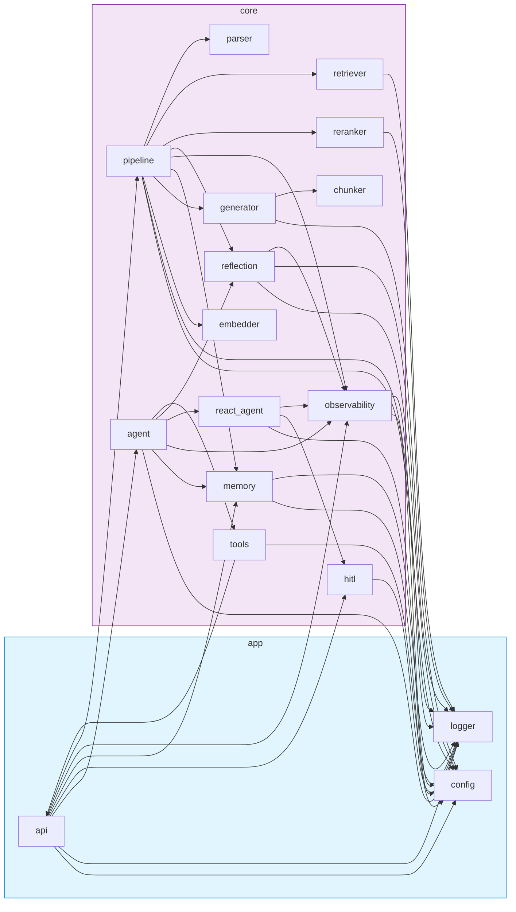

# 模块依赖图

## 图例

| 颜色 | 包 |
|------|-----|
| 🟦 浅蓝 | `app` — 应用层（API、配置、日志） |
| 🟪 浅紫 | `core` — 核心 RAG + Agent 逻辑 |

## 关键观察

- **`pipeline`** 是 RAG 管线的核心编排者，几乎依赖所有 core 子模块
- **`agent`** 是 Agent 入口，聚合 `react_agent`、`reflection`、`tools`
- **`api`** 作为 FastAPI 入口，依赖 core 层多个模块
- `config` 和 `logger` 是公共基础设施，大量模块依赖它们
- **`tools` → `api`** 的箭头表示工具回调注册了 API 路由（双向耦合）
